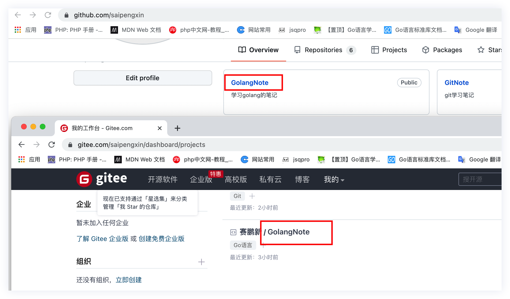

# 将本地仓库的内容同时提交到GitHub和Gitee

## 前情提要

​		今天入职了新的公司，由于是从PHP转GO语言，肯定需要一定的时间去学习和适应。所以突然就有了记笔记的念头。想要将工作中或者自己学习的东西记录下来。

​		之前一直也有记笔记，使用的是有道云笔记，但是这个笔记软件使用起来一直不是特别喜欢，其实已经挑了好久的笔记软件了，但是还是没有特别满意的。所以考虑了好久，决定使用Markdown配合GitHub来进行笔记的编写和存储。

​		之前就有过使用Markdown配合GitHub来进行笔记编写和存储的想法，但是当时觉得有点麻烦所以没有实施行动。这次趁着换工作，换个心情，就搞起来。

​		选择这个组合有以下几个考虑：

- 使用笔记软件，笔记内容在本地是加密的，只能通过指定的软件打开才能读取。而md文件，我们只要使用md编辑器甚至是vscode，phpstorm等代码编辑器都可以进行阅读和编辑。
- markdown的书写方式相比于有道云笔记要舒服很多，而且排版简洁清晰，有道云笔记虽然也可以自己排版，但是我总是排着排着就发现乱套了。。。
- 可以在线查看阅读。
- 也是希望大家可以看见吧，笔记软件的笔记只能自己看，但是发到网上就不是这样了，大家都能看，和大家互相学习探讨。当初看人家写的技术博文有好多人看，自己也想写，但是从来没有行动，这次就算是行动一下吧，憧憬着有一天我的某一个仓库可以过100star吧，哈哈。

​		之所以选择GitHub和Gitee两个代码托管平台，也是因为国内GitHub访问实在是太不稳定了，时不时就连不上，而且又不是随时随地能搭梯子，所以就想着在Gitee也保存一份，所以这个平台不如GitHub出名，但是是国内的，访问速度很快。


## 操作流程

​		例如，我们要建立一个golang的学习笔记仓库，并同时推送到GitHub和Gitee

- 首先，我们要在本地生成SSH密钥，并配置倒GitHub、Gitee

​		我们可以使用如下命令生成SSH密钥：

```
$ ssh-keygen -t ed25519 -C "your_email@example.com"
或者
$ ssh-keygen -t rsa -b 4096 -C "your_email@example.com"
```

​		生成密钥后，一般默认都是在你的家目录下有一个 `.ssh` 文件夹，我们要将里面的 ` id_rsa.pub`文件中的内容，复制并配置在托管平台对应的位置。

> GitHub：点击右上角头像 -> setting -> SSH and GPG keys -> new ssh key
>
> Gitee : 右上角头像 -> 设置 -> SSH 公钥


- 然后，在两个平台都建立代码存储仓库

  